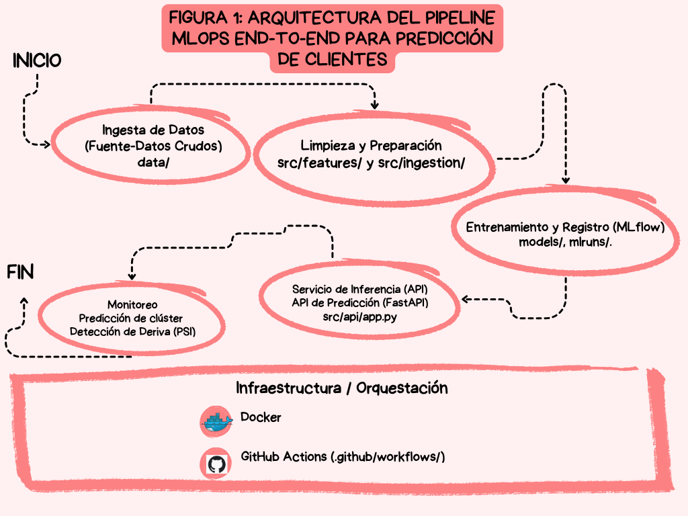

# Online Retail MLOps Project: Segmentación de Clientes y Monitoreo de Deriva

Este proyecto implementa una solución end-to-end de MLOps para la segmentación de clientes mediante clustering y el monitoreo en tiempo real de la deriva de datos (Data Drift) utilizando FastAPI, Docker y MLflow.

---

## 1. Business Problem
El objetivo de este proyecto es segmentar a los clientes de una plataforma de comercio electrónico en función de su comportamiento de compra (métricas RFM: Recency, Frequency, Monetary). Esto permite personalizar estrategias de marketing y detectar de forma temprana el deterioro en el rendimiento del modelo debido a cambios en el comportamiento de los datos.

## 2. Dataset
Se utiliza el dataset público **Online Retail**, el cual contiene transacciones de compras realizadas entre 2010 y 2011. A partir de estas transacciones se construyen las características RFM principales:
* **Recency:** Días transcurridos desde la última compra.
* **Frequency:** Número total de transacciones realizadas.
* **Monetary:** Monto total gastado por el cliente.

## 3. Architecture
La arquitectura del proyecto sigue el siguiente flujo de MLOps:
1. **Ingesta y Limpieza de Datos:** Procesamiento de datos crudos en la tubería de Python.
2. **Entrenamiento y Tracking:** Entrenamiento del modelo de clustering e ingeniería de variables registrando métricas y artefactos en **MLflow**.
3. **Contenedorización:** Empaquetado del servicio web utilizando **Docker**.
4. **Despliegue de API:** Exposición de endpoints REST mediante **FastAPI** para inferencia y monitoreo.
5. **Monitoreo (Data Drift):** Evaluación del Population Stability Index (PSI) para detectar variaciones de distribución.

## 4. Repository Structure


```text
.
├── data/                    # [Entregable 3] Datos crudos y procesados (data/raw/, data/processed/)
├── src/                     
│   ├── api/                 
│   │   └── app.py           # [Entregable 8] Endpoint POST /predict con FastAPI
│   ├── features/            
│   │   └── build_features.py # [Entregable 4-5] Pipeline de ingeniería de características
│   ├── ingestion/           
│   │   └── ingest.py        # [Entregable 3] Scripts de ingesta de datos
│   ├── models/              
│   │   └── train.py         # [Entregable 5-6] Entrenamiento, validación y registro en MLflow
│   ├── monitoring/          
│   │   └── drift_detector.py # [Entregable 10-11] Cálculo de PSI y detección de deriva
│   └── quality/             
│       └── clean.py         # [Entregable 2] Módulos de limpieza y calidad de datos
├── mlruns/                  # [Entregable 6] Tracking de experimentos, métricas y artefactos de MLflow
├── tests/                   # [Entregable 9] Pruebas automatizadas (pytest)
├── Dockerfile               # [Entregable 7] Contenedorización de la aplicación
├── requirements.txt         # [Entregable 1] Dependencias y gestión de paquetes
└── README.md                # [Entregable 2, 12, 13] Documentación, guía e informe técnico
```

## 5. Installation
Clona este repositorio y configura el entorno local:

```bash
git clone https://github.com/marijoespinal-lgtm/OnlineRetail-MLops.git
cd OnlineRetail-MLops
python -m venv venv
# En Windows (PowerShell):
.\venv\Scripts\Activate.ps1
# Instalar dependencias:
pip install -r requirements.txt
```

## 6. Data Ingestion
Ejecuta el script de ingesta de datos para procesar el dataset original de Online Retail y generar el conjunto de datos limpio con las métricas RFM (Recency, Frequency, Monetary):

```bash
python src/ingestion/ingest.py
```

## 7. Training
Ejecuta el script de entrenamiento para procesar las variables RFM, entrenar el modelo de segmentación de clientes y guardar los artefactos generados:

```bash
# Entrenar el modelo
python src/models/train.py

# Validar el modelo
python src/models/validation.py
```

## 8. MLflow & Experiment Tracking
Para iniciar la interfaz de usuario de MLflow y revisar las métricas, parámetros y experimentos registrados durante el entrenamiento del modelo:

```bash
mlflow ui
```
Una vez ejecutado el comando, abre tu navegador en http://127.0.0.1:5000 para acceder al panel interactivo de MLflow.


## 9. Docker Support
Para empaquetar y desplegar la aplicación mediante contenedores de Docker, ejecuta los siguientes comandos en la raíz del proyecto:

```bash
# Construir la imagen de Docker:
docker build -t online-retail-mlops .

# Ejecutar el contenedor expuesto en el puerto 8000:
docker run -d -p 8000:8000 --name online-retail-app online-retail-mlops
```
Una vez iniciado el contenedor, la API y sus endpoints estarán disponibles en http://localhost:8000/docs.

## 10. API & Endpoints
Inicia el servidor local de FastAPI para exponer los endpoints de inferencia y segmentación de clientes:

```bash
uvicorn src.api.app:app --reload
```
Una vez en ejecución, la API estará disponible en http://127.0.0.1:8000 y la documentación interactiva (Swagger UI) se puede consultar en:

http://127.0.0.1:8000/docs

## 11. Data Drift Monitoring
Para evaluar la deriva de datos (Data Drift) y la estabilidad de las distribuciones mediante el indicador Population Stability Index (PSI):

```bash
# Ejecutar el monitoreo de Data Drift
python -m src.monitoring.drift_detector
```

## 12. Results 
A continuación se resumen los resultados obtenidos en las diferentes etapas del flujo de trabajo de MLOps:

* **Segmentación de Clientes (RFM & Clustering):** Se identificaron segmentos claros de comportamiento de compra basados en Recency, Frequency y Monetary, permitiendo categorizar a los usuarios en grupos de alto valor, recurrentes y en riesgo de abandono.
* **Evaluación de Data Drift (PSI):** Las métricas del Population Stability Index permitieron detectar variaciones en las distribuciones de las características a lo largo del tiempo, asegurando alertas tempranas ante cambios en el comportamiento de los datos.
* **Despliegue y Productivización:** Se logró empaquetar el flujo en un servicio FastAPI funcional y containerizado en Docker, garantizando inferencias rápidas y consistentes.

## 13. Team & Authors
Este proyecto fue desarrollado por:

* **María Espinoza— Data Engineer & Quality Lead**
  * **Rol y Enfoque:** Garantizar la ingesta automática, limpieza, validación y robustez de los datos en el pipeline.
  * **Contribuciones Clave:**
    * Ingesta reproducible desde UCI Online Retail (`src/ingestion/ingest.py`).
    * Implementación de limpieza de datos, reglas de validación y Quality Gates (`src/quality/clean.py` y `src/quality/validation.py`).
    * Desarrollo del script de simulación de contaminación de datos (`src/quality/contamination.py`).

* **Enrique Segura — Machine Learning & Feature Engineer**
  * **Rol y Enfoque:** Transformar datos transaccionales en perfiles de clientes y desarrollar/evaluar el pipeline de modelado.
  * **Contribuciones Clave:**
    * Análisis exploratorio (EDA) y pipeline de ingeniería de variables RFM ampliadas y comportamentales (`src/features/build_features.py`).
    * Entrenamiento de algoritmos de clustering (K-Means, DBSCAN, Agglomerative) y registro de métricas/artefactos en MLflow (`src/models/train.py`).
    * Configuración del Model Registry para la promoción del modelo a estado "Production".

* **Joselyn Herrera — MLOps, API & Monitoring Engineer**
  * **Rol y Enfoque:** Despliegue de la solución, containerización, automatización de pruebas y observabilidad/monitoreo del modelo.
  * **Contribuciones Clave:**
    * Desarrollo de la API REST con FastAPI para inferencia de clusters (`src/api/app.py`).
    * Empaquetado y containerización de la aplicación mediante Docker (`Dockerfile`).
    * Pruebas unitarias/integración con Pytest y sistema de detección de Data Drift mediante Population Stability Index (PSI) (`src/monitoring/drift_detector.py`).

    ## Arquitectura del Proyecto

